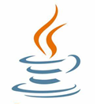
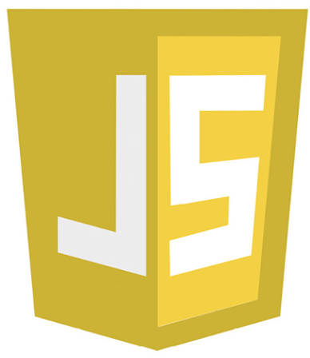
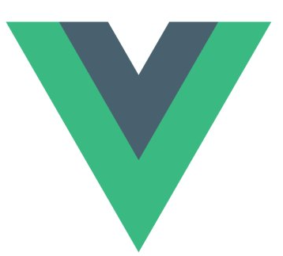
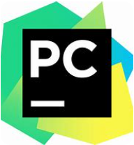
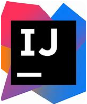
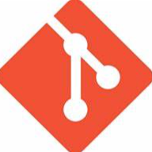

## ☀️About me

- Gopher

- I'm currently a postgraduate student on AnHui University, majoring in **Computer Science**.

- My research field is large vehicle modal in multi-modal re-identification.

- You can get in touch with me by email at **coderyjc@163.com**.

## 📈Statistics

    
    

## 🔨I Code With...

 

**Languages**

<code></code>
<code></code>
<code></code>
<code></code>
<code></code>
<code></code>

**Frameworks**

<code></code>
<code></code>
<code></code>
<code></code>
<code></code>
<code></code>
<code></code>
<code></code>
<code></code>

**Tools and Environments**

<code></code>
<code></code>
<code></code>
<code></code>
<code></code>
<code></code>
